4. HASIL DAN PEMBAHASAN

4.1 Hasil Pengumpulan Data

Pengumpulan data pada penelitian ini dilakukan melalui teknik web scraping dengan memanfaatkan pustaka google-play-scraper yang dijalankan pada bahasa pemrograman Python. Proses scraping diarahkan untuk menghimpun ulasan pengguna aplikasi Roblox pada platform Google Play Store, dengan menerapkan filter bahasa Indonesia dan wilayah Indonesia serta pengurutan berdasarkan ulasan terbaru, sehingga data yang diperoleh merepresentasikan ulasan pengguna berbahasa Indonesia pada periode penelitian.

Ulasan yang berhasil dihimpun mencakup rentang waktu mulai tanggal 25 Februari 2026 hingga 22 April 2026. Pemilihan rentang waktu tersebut dimaksudkan untuk memperoleh gambaran sentimen pengguna dalam periode yang cukup panjang, sehingga memungkinkan dilakukannya analisis tren temporal pada subbab pembahasan selanjutnya.

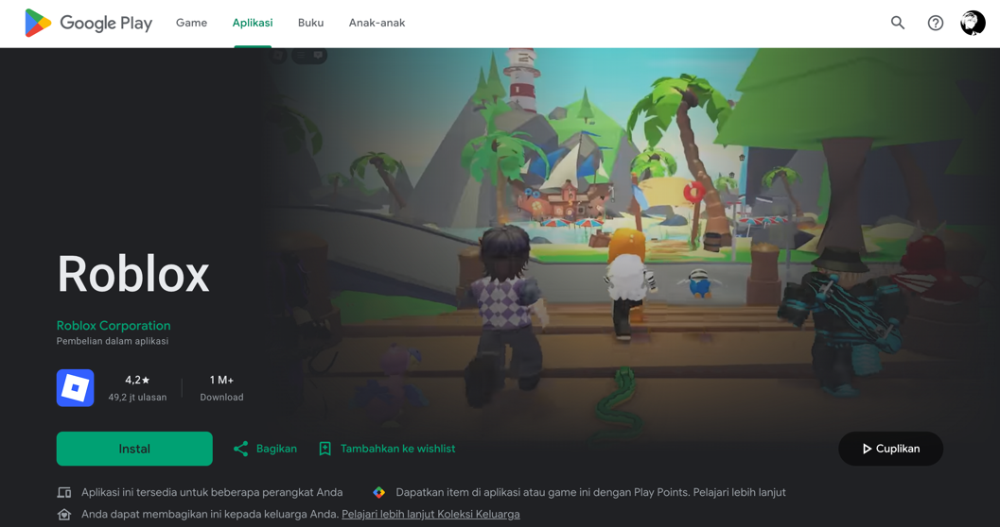

Gambar 4.1 Halaman Aplikasi Roblox di Google Play Store

Gambar 4.1 menampilkan halaman aplikasi Roblox pada Google Play Store yang menjadi sumber data penelitian. Halaman tersebut memuat informasi dasar aplikasi, seperti nama aplikasi, peringkat (rating), jumlah unduhan, dan ulasan pengguna yang dapat diakses secara publik.

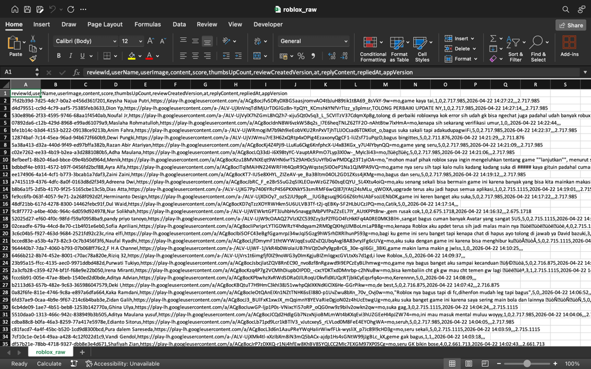

Gambar 4.2 Hasil Scraping Dataset Format CSV

Gambar 4.2 menunjukkan contoh data hasil scraping dalam format CSV, yang mencakup kolom content (teks ulasan), score (peringkat bintang), dan at (tanggal ulasan). Format tersebut memudahkan proses penyimpanan dan pengolahan data pada tahap selanjutnya.

Dari target sebanyak 50.000 ulasan yang ditetapkan sebelumnya, penelitian ini berhasil memperoleh sebanyak 49.485 ulasan yang memuat ketiga atribut tersebut. Keseluruhan data hasil scraping kemudian disimpan dalam format CSV sebagai raw dataset yang selanjutnya digunakan pada tahap praproses teks sebelum proses pelabelan otomatis dan pelatihan model.

4.2 Hasil Praproses Teks

Praproses teks dilakukan untuk membersihkan dan menyeragamkan data ulasan sebelum digunakan pada tahap pelatihan model. Tahapan praproses yang diterapkan pada penelitian ini meliputi case folding, cleaning, tokenisasi, penanganan negasi, penghapusan stopword, dan stemming, yang dilaksanakan secara berurutan terhadap seluruh data ulasan.

Dari 50.000 ulasan target hasil scraping, berhasil diperoleh 49.485 ulasan yang valid (515 data dieliminasi karena tidak lengkap atau tidak relevan). Seluruh 49.485 data tersebut kemudian digunakan untuk tahapan praproses teks dan analisis selanjutnya.

Hasil dari setiap tahapan praproses dijelaskan secara rinci pada subbab-subbab berikut, disertai dengan contoh transformasi teks yang terjadi pada masing-masing proses guna memberikan gambaran konkret mengenai perubahan data pada setiap tahapan.

4.2.1 Hasil Case Folding

Case folding dilakukan dengan mengubah seluruh karakter teks menjadi huruf kecil untuk mengeliminasi variasi representasi kata yang timbul akibat perbedaan penggunaan huruf kapital pada teks ulasan.

Proses ini memastikan bahwa kata-kata yang secara semantik memiliki makna sama diperlakukan identik oleh model, sehingga tidak terjadi duplikasi representasi kata semata-mata karena perbedaan kapitalisasi huruf.

Tabel 4.3 Hasil Case Folding

| No. | Teks Sebelum Case Folding | Teks Setelah Case Folding |
| --- | --- | --- |
| 1 | TOLONG PERBAIKI UPDATE NYA | tolong perbaiki update nya |
| 2 | PERMAINAN YANG BAGUS! SAYA MENYUKAINYA | permainan yang bagus! saya menyukainya |
| 3 | BALIKKAN CHAT LAGI ROBLOX!! | balikkan chat lagi roblox!! |

Berdasarkan Tabel 4.3, seluruh teks ulasan yang sebelumnya ditulis menggunakan huruf kapital berhasil diseragamkan menjadi huruf kecil tanpa mengubah makna maupun struktur kalimat aslinya. Konsistensi representasi huruf ini penting agar variasi penulisan kata yang sebenarnya bermakna sama tidak dihitung sebagai token yang berbeda pada tahap analisis selanjutnya.

4.2.2 Hasil Cleaning

Tahap cleaning dilakukan untuk menghapus karakter-karakter yang tidak relevan bagi proses klasifikasi, meliputi tautan (URL), angka, karakter HTML, tanda baca, dan karakter non-alfanumerik lainnya.

Tujuan tahap ini adalah mengurangi derau (noise) pada data teks yang dapat mengganggu proses pembelajaran model apabila tidak dibersihkan terlebih dahulu.

Tabel 4.4 Hasil Data Cleaning

| No. | Teks Sebelum Cleaning | Teks Setelah Cleaning |
| --- | --- | --- |
| 1 | permainan yang bagus! saya menyukainya | permainan yang bagus saya menyukainya |
| 2 | aku suka tapi kadang-kadang ada bug tapi aku kasih bitang 5 ko | aku suka tapi kadang kadang ada bug tapi aku kasih bitang ko |
| 3 | roblox tu sangat seru tapi bikin hp aku panas/ngelek jadi mohon tolong di perbaiki ya | roblox tu sangat seru tapi bikin hp aku panas ngelek jadi mohon tolong di perbaiki ya |

Berdasarkan Tabel 4.4, karakter-karakter yang tidak relevan, seperti tanda baca dan simbol khusus, berhasil dihapus dari teks ulasan tanpa menghilangkan substansi informasi yang dikandungnya. Dengan berkurangnya elemen-elemen non-alfanumerik tersebut, teks ulasan menjadi lebih bersih dan siap dipecah menjadi token-token individual pada tahap tokenisasi.

4.2.3 Hasil Tokenisasi

Tokenisasi dilakukan untuk memecah teks yang telah dibersihkan menjadi satuan-satuan kata (token) sebagai unit dasar analisis pada tahap pemodelan selanjutnya. Proses tokenisasi pada penelitian ini menggunakan pustaka NLTK yang mendukung pemisahan teks berbasis tanda baca untuk bahasa Indonesia.

Tabel 4.5 Hasil Tokenisasi

| No. | Teks Sebelum Tokenisasi | Token Setelah Tokenisasi |
| --- | --- | --- |
| 1 | permainan yang bagus saya menyukainya | ["permainan", "yang", "bagus", "saya", "menyukainya"] |
| 2 | aku suka tapi kadang kadang ada bug tapi aku kasih bitang ko | ["aku", "suka", "tapi", "kadang", "kadang", "ada", "bug", "tapi", "aku", "kasih", "bitang", "ko"] |
| 3 | roblox tu sangat seru tapi bikin hp aku panas ngelek jadi mohon tolong di perbaiki ya | ["roblox", "tu", "sangat", "seru", "tapi", "bikin", "hp", "aku", "panas", "ngelek", "jadi", "mohon", "tolong", "di", "perbaiki", "ya"] |

Berdasarkan Tabel 4.5, setiap teks ulasan berhasil dipecah menjadi token-token individual yang selanjutnya siap digunakan pada tahap penanganan negasi dan penghapusan stopword. Pemisahan pada tingkat kata ini menjadi unit dasar yang memungkinkan proses ekstraksi fitur maupun tokenisasi pada model dilakukan secara lebih sistematis dan frekuensi kemunculan kata secara lebih terstruktur dibandingkan dengan memperlakukan teks sebagai satu kesatuan kalimat.

4.2.4 Hasil Penanganan Negasi

Kata-kata negasi, seperti “tidak”, “bukan”, dan “jangan”, digabungkan dengan kata yang mengikutinya menggunakan penanda khusus, misalnya frasa “tidak bisa” menjadi bisa_NEG. Pendekatan ini bertujuan untuk mempertahankan makna semantik berlawanan agar tidak hilang pada saat proses penghapusan stopword berlangsung.

Tabel 4.6 Hasil Penanganan Negasi

| No. | Token Sebelum Penanganan Negasi | Token Setelah Penanganan Negasi |
| --- | --- | --- |
| 1 | ["padahal", "saya", "suka", "game", "ini", "knp", "saya", "pas", "mau", "login", "hari", "ini", "ga", "bisa"] | ["padahal", "saya", "suka", "game", "ini", "knp", "saya", "pas", "mau", "login", "hari", "ini", "bisa_NEG"] |
| 2 | ["gak", "bisa", "ngechat", "mulai", "rusak", "game", "nya"] | ["bisa_NEG", "ngechat", "mulai", "rusak", "game", "nya"] |
| 3 | ["roblox", "tolong", "ya", "robux", "nya", "jangan", "pake", "uang", "segala", "bisa", "di", "marahin", "orang", "tua"] | ["roblox", "tolong", "ya", "robux", "nya", "pake_NEG", "uang", "segala", "bisa", "di", "marahin", "orang", "tua"] |

Berdasarkan Tabel 4.6, kata negasi berhasil digabungkan dengan kata berikutnya menggunakan penanda _NEG, sehingga makna berlawanan pada kalimat tetap terjaga meskipun kata negasi tersebut termasuk dalam daftar stopword yang akan dihapus. Tanpa penanganan ini, kata negasi berisiko terhapus begitu saja pada tahap penghapusan stopword, sehingga kalimat yang sebenarnya bermakna negatif dapat salah diinterpretasikan sebagai kalimat positif oleh model.

4.2.5 Hasil Penghapusan Stopword

Kata-kata yang tidak membawa bobot semantik signifikan dihapus menggunakan daftar stopword bahasa Indonesia dari korpus NLTK. Daftar stopword ini digunakan secara langsung tanpa modifikasi tambahan pada tahap ini.

Tabel 4.7 Hasil Stopword Removal

| No. | Token Sebelum Stopword Removal | Token Setelah Stopword Removal |
| --- | --- | --- |
| 1 | ["permainan", "yang", "bagus", "saya", "menyukainya"] | ["permainan", "bagus", "menyukainya"] |
| 2 | ["aku", "suka", "tapi", "kadang", "kadang", "ada", "bug", "tapi", "aku", "kasih", "bitang", "ko"] | ["suka", "kadang", "kadang", "bug", "kasih", "bitang"] |
| 3 | ["roblox", "tu", "sangat", "seru", "tapi", "bikin", "hp", "aku", "panas", "ngelek", "jadi", "mohon", "tolong", "di", "perbaiki", "ya"] | ["roblox", "seru", "bikin", "panas", "ngelek", "mohon", "tolong", "perbaiki"] |

Berdasarkan Tabel 4.7, kata-kata yang tidak relevan secara semantik berhasil dihilangkan dari token ulasan, sehingga token yang tersisa lebih merepresentasikan inti dari isi ulasan pengguna. Pengurangan jumlah token pada tahap ini juga membantu mengurangi jumlah token yang tidak informatif sehingga representasi teks menjadi lebih ringkas.

4.2.6 Hasil Stemming

Setiap kata direduksi ke bentuk dasarnya menggunakan algoritma Nazief-Adriani yang diimplementasikan melalui pustaka PySastrawi. Proses ini menyeragamkan variasi morfologis kata dalam bahasa Indonesia, sehingga kata-kata dengan bentuk berbeda namun bermakna sama dapat diperlakukan secara konsisten oleh model.

Tabel 4.8 Hasil Stemming

| No. | Token Sebelum Stemming | Token Setelah Stemming | Hasil Akhir |
| --- | --- | --- | --- |
| 1 | ["tolong", "perbaiki", "update"] | ["tolong", "baik", "update"] | tolong baik update |
| 2 | ["permainan", "bagus", "menyukainya"] | ["main", "bagus", "suka"] | main bagus suka |
| 3 | ["roblox", "seru", "bikin", "panas", "ngelek", "mohon", "tolong", "perbaiki"] | ["roblox", "seru", "bikin", "panas", "ngelek", "mohon", "tolong", "baik"] | roblox seru bikin panas ngelek mohon tolong baik |

Berdasarkan Tabel 4.8, setiap kata berhasil direduksi ke bentuk dasarnya, sehingga variasi imbuhan pada kata dapat disatukan menjadi satu representasi yang konsisten sebelum data digunakan pada tahap pelabelan otomatis. Dengan demikian, seluruh tahapan praproses yang telah dijelaskan pada subbab 4.2.1 hingga 4.2.6 menghasilkan teks ulasan yang bersih, konsisten, dan siap digunakan sebagai masukan bagi proses pelabelan otomatis menggunakan teacher model pada subbab berikutnya.

4.3 Hasil Auto-Labeling Berbasis Teacher Model

Tahapan auto-labeling berbasis teacher model dilakukan untuk menghasilkan label sentimen secara otomatis tanpa memerlukan anotasi manual yang memakan waktu dan biaya. Model RoBERTa berbahasa Indonesia (w11wo/indonesian-roberta-base-sentiment-classifier) berperan sebagai teacher model yang memprediksi sentimen teks ulasan secara langsung berdasarkan konteks semantiknya.

Hasil prediksi teacher model menghasilkan pseudo-label yang terbentuk dari prediksi teacher model, yang selanjutnya digunakan secara langsung sebagai label final pada proses fine-tuning model IndoBERT pada subbab selanjutnya.

4.3.1 Distribusi Pseudo-Label

Pelabelan otomatis dilakukan menggunakan pendekatan teacher-student dengan model RoBERTa berbahasa Indonesia (w11wo/indonesian-roberta-base-sentiment-classifier) sebagai teacher model. Proses pelabelan menghasilkan tiga kelas sentimen, yaitu positif, netral, dan negatif.

Tabel 4.9 Distribusi Hasil Pseudo-Labeling

| Kelas Sentimen | Jumlah Ulasan | Persentase |
| --- | --- | --- |
| Negatif | 19.673 | 39,76% |
| Netral | 7.290 | 14,73% |
| Positif | 22.522 | 45,51% |
| Total | 49.485 | 100,00% |

Tabel 4.9 menunjukkan distribusi pseudo-label yang dihasilkan oleh teacher model. Kelas positif mendominasi dataset dengan 22.522 ulasan (45,51%), diikuti oleh kelas negatif sebanyak 19.673 ulasan (39,76%), dan kelas netral sebanyak 7.290 ulasan (14,73%).

Distribusi kelas yang dihasilkan relatif lebih seimbang dibandingkan dengan distribusi label berbasis rating, meskipun kelas positif tetap menjadi kelas dengan proporsi terbesar. Proporsi kelas negatif yang cukup tinggi (39,76%) mengindikasikan bahwa teacher model mampu menangkap sentimen negatif dari isi teks ulasan yang tidak selalu tercermin secara eksplisit pada skor rating, dan hal ini menjadi pertimbangan penting dalam proses pelatihan model pada tahap selanjutnya. Distribusi pseudo-label ini hanya digunakan sebagai data pelatihan bagi model IndoBERT dan bukan merupakan hasil prediksi akhir yang digunakan pada analisis tren temporal maupun dashboard.

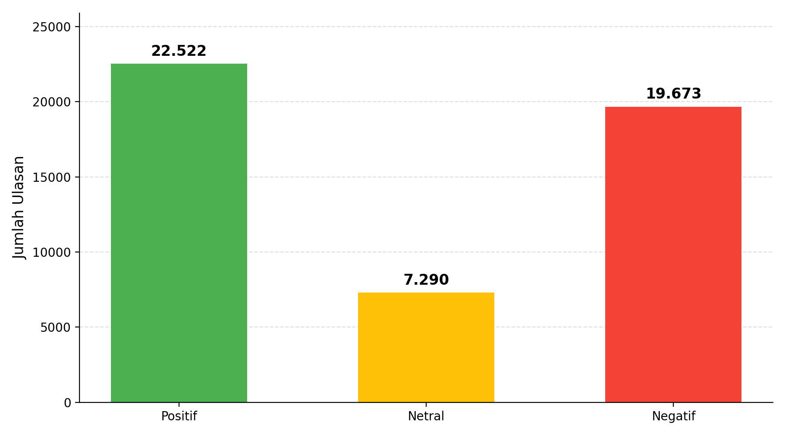

Gambar 4.3 Bar Chart Distribusi Pseudo-Label

Gambar 4.3 memvisualisasikan distribusi pseudo-label hasil prediksi teacher model dalam bentuk diagram batang. Visualisasi tersebut menunjukkan bahwa kelas positif memiliki jumlah data terbesar, diikuti oleh kelas negatif, sedangkan kelas netral merupakan kelas dengan jumlah sampel paling sedikit.

4.4 Hasil Model SVM Baseline

Model Support Vector Machine (SVM) dibangun sebagai model baseline untuk memberikan acuan performa awal sebelum penerapan model berbasis Transformer. Model SVM memanfaatkan representasi fitur TF-IDF dan dilatih menggunakan strategi One-vs-Rest (OvR) agar dapat menangani klasifikasi tiga kelas sentimen secara bersamaan.

Pemilihan SVM sebagai model baseline didasarkan pada kemampuannya yang telah banyak dibuktikan pada berbagai penelitian klasifikasi teks, sehingga dapat digunakan sebagai pembanding yang layak terhadap model berbasis Transformer.

Subbab ini menjelaskan konfigurasi yang digunakan serta hasil evaluasi model SVM pada data uji.

4.4.1 Konfigurasi Model SVM

Model SVM dibangun menggunakan representasi fitur TF-IDF dengan max_features sebesar 5.000, kernel linear, parameter C sebesar 1,0, dan strategi One-vs-Rest (OvR) untuk menangani klasifikasi tiga kelas.

Pembagian data menggunakan rasio 80% data latih dan 20% data uji dengan random_state sebesar 42 untuk memastikan reproduktibilitas eksperimen.

Konfigurasi tersebut dipilih berdasarkan praktik umum yang lazim digunakan pada penelitian klasifikasi sentimen berbasis machine learning konvensional.

4.4.2 Hasil Evaluasi SVM

Hasil evaluasi model SVM pada data uji ditunjukkan pada Tabel 4.10.

Tabel 4.10 Classification Report Model SVM Baseline

| Kelas Sentimen | Precision | Recall | F1-Score | Support |
| --- | --- | --- | --- | --- |
| negatif | 74,29% | 79,63% | 76,87% | 2.798 |
| netral | 33,33% | 0,15% | 0,30% | 654 |
| positif | 86,73% | 92,79% | 89,66% | 6.445 |
| accuracy |  |  | 82,94% | 9.897 |
| macro avg | 64,78% | 57,52% | 55,61% | 9.897 |
| weighted avg | 80,00% | 82,94% | 80,00% | 9.897 |

Berdasarkan Tabel 4.10, model SVM baseline memperoleh akurasi keseluruhan sebesar 82,94%. Model menunjukkan performa yang baik pada kelas positif dengan F1-score 89,66% dan kelas negatif dengan F1-score 76,87%.

Namun, model mengalami kegagalan yang hampir total pada kelas netral, dengan nilai recall yang hanya mencapai 0,15% sehingga F1-score hanya bernilai 0,30%, meskipun nilai precision tercatat sebesar 33,33% akibat sangat sedikitnya sampel yang diprediksi sebagai netral. Temuan ini mengindikasikan bahwa model SVM nyaris tidak mampu mengidentifikasi ulasan bersentimen netral dan cenderung mengklasifikasikan hampir seluruh sampel ke dalam kelas positif atau negatif.

Kegagalan tersebut sangat dipengaruhi oleh ketidakseimbangan data, di mana kelas netral hanya memiliki 654 sampel dibandingkan dengan 6.445 sampel positif dan 2.798 sampel negatif. Keterbatasan representasi fitur TF-IDF turut berperan, karena metode tersebut tidak mampu menangkap konteks semantik yang membedakan ulasan netral dari kelas lainnya. Nilai macro average F1-score yang hanya sebesar 55,61% mencerminkan ketimpangan performa antarkelas yang cukup besar pada model SVM.

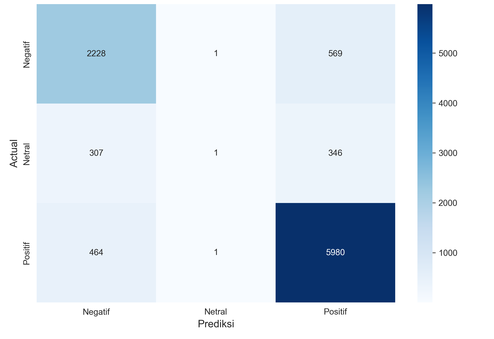

Gambar 4.4 Confusion Matrix Model SVM Baseline

Gambar 4.4 menampilkan confusion matrix model SVM Baseline yang secara visual menunjukkan sebagian besar sampel kelas netral salah diklasifikasikan ke kelas positif atau negatif. Dari 654 sampel netral, hanya 1 sampel yang berhasil diklasifikasikan dengan benar, 307 sampel salah diklasifikasikan ke kelas negatif, dan 346 sampel salah diklasifikasikan ke kelas positif.

Sementara itu, untuk kelas negatif, dari 2.798 sampel, sebanyak 2.228 sampel diklasifikasikan dengan benar, 1 sampel salah diklasifikasikan ke kelas netral, dan 569 sampel salah diklasifikasikan ke kelas positif. Untuk kelas positif, dari 6.445 sampel, sebanyak 5.980 sampel diklasifikasikan dengan benar, 464 sampel salah diklasifikasikan ke kelas negatif, dan 1 sampel salah diklasifikasikan ke kelas netral.

4.5 Hasil Fine-Tuning IndoBERT

Tahap fine-tuning IndoBERT merupakan salah satu tahap metodologis penting dalam penelitian ini, di mana model bahasa pra-latih indobenchmark/indobert-base-p1 disesuaikan menggunakan dataset berlabel hasil auto-labeling berbasis teacher model untuk tugas klasifikasi sentimen tiga kelas. Proses ini terdiri atas tiga bagian utama, yaitu konfigurasi parameter fine-tuning, pemantauan proses pelatihan per epoch, dan evaluasi performa model pada data uji. Keseluruhan proses pelatihan dijalankan menggunakan GPU NVIDIA RTX 2060 dengan akselerasi CUDA untuk mempercepat komputasi selama proses fine-tuning berlangsung. Hasil evaluasi model ini selanjutnya dibandingkan dengan SVM baseline pada subbab 4.6 untuk menentukan model yang digunakan pada analisis tren temporal.

4.5.1 Konfigurasi Fine-Tuning

Proses fine-tuning dilakukan terhadap model pra-latih indobenchmark/indobert-base-p1 menggunakan dataset berlabel hasil auto-labeling berbasis teacher model. Konfigurasi yang digunakan meliputi panjang sekuens maksimum 128 token, batch size 32, jumlah epoch sebanyak 5, learning rate sebesar 2×10⁻⁵, optimizer AdamW, dan fungsi loss CrossEntropyLoss. Pembagian dataset menggunakan proporsi 72% data latih, 8% data validasi, dan 20% data uji, guna memastikan model dievaluasi pada data yang belum pernah dilihat selama proses pelatihan.

Perlu dicatat bahwa proses pembagian data uji untuk model SVM dan IndoBERT dilakukan secara independen menggunakan skrip yang berbeda, sehingga komposisi jumlah sampel per kelas pada kedua test set tidak sepenuhnya identik meskipun jumlah total data uji sama, yaitu 9.897 ulasan (20% dari keseluruhan 49.485 data). Perbedaan ini tidak memengaruhi validitas evaluasi masing-masing model secara individual, namun perlu menjadi catatan dalam menginterpretasikan perbandingan performa antarmodel pada subbab 4.6.

4.5.2 Pemantauan Proses Pelatihan

Proses pelatihan IndoBERT dilakukan selama 5 epoch dengan memantau nilai loss dan akurasi pada data latih dan validasi. Pada setiap epoch, model dievaluasi pada data validasi, dan model dengan performa terbaik disimpan sebagai best_model_annotated/. Proses pelatihan menunjukkan penurunan loss yang konsisten dan peningkatan akurasi yang stabil, menunjukkan bahwa model berhasil belajar dengan baik tanpa terjadi overfitting atau underfitting.

4.5.3 Hasil Evaluasi IndoBERT

Hasil evaluasi model IndoBERT pada data uji ditunjukkan pada Tabel 4.11.

Tabel 4.11 Classification Report Model IndoBERT

| Kelas Sentimen | Precision | Recall | F1-Score | Support |
| --- | --- | --- | --- | --- |
| negatif | 82,00% | 87,00% | 84,00% | 3.283 |
| netral | 79,00% | 64,00% | 71,00% | 1.166 |
| positif | 92,00% | 92,00% | 92,00% | 5.448 |
| accuracy |  |  | 87,22% | 9.897 |
| macro avg | 84,44% | 81,15% | 82,50% | 9.897 |
| weighted avg | 87,00% | 87,22% | 87,00% | 9.897 |

Berdasarkan Tabel 4.11, model IndoBERT memperoleh akurasi sebesar 87,22% dengan macro average F1-score sebesar 82,50%. Berbeda dengan SVM, IndoBERT berhasil mengklasifikasikan ketiga kelas sentimen dengan performa yang jauh lebih seimbang. Kelas positif memperoleh F1-score tertinggi sebesar 92,00%, diikuti oleh kelas negatif dengan 84,00%, dan kelas netral dengan 71,00%. Peningkatan yang paling signifikan terlihat pada kelas netral, di mana IndoBERT berhasil mencapai F1-score 71,00% dibandingkan dengan SVM yang hanya mencapai 0,30%.

Kemampuan tersebut bersumber dari arsitektur transformer IndoBERT yang mampu memahami konteks semantik teks secara bidireksional, sehingga dapat membedakan nuansa sentimen yang ambigu pada kelas netral dengan jauh lebih baik dibandingkan representasi TF-IDF pada model SVM.

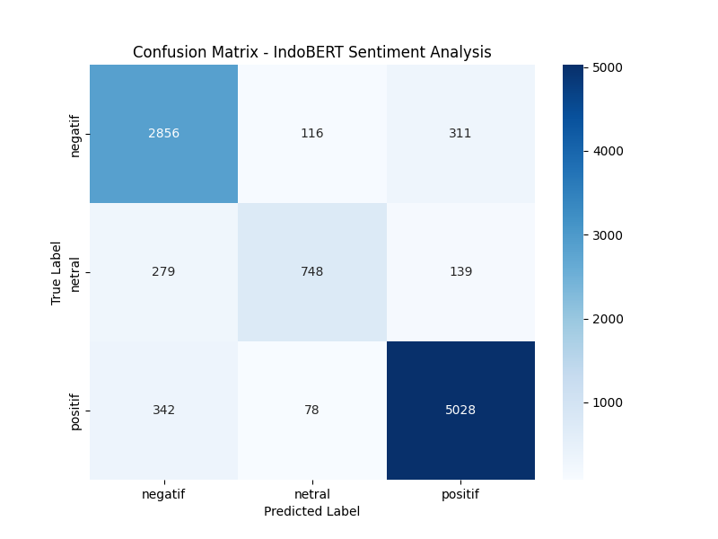

Gambar 4.5 Confusion Matrix Model IndoBERT

Gambar 4.5 menampilkan confusion matrix model IndoBERT pada data uji, yang menunjukkan perbandingan antara label aktual dan label hasil prediksi untuk masing-masing kelas sentimen. Pada kelas negatif, dari total 3.283 sampel, sebanyak 2.856 sampel diklasifikasikan dengan benar, sedangkan 116 sampel salah diklasifikasikan sebagai netral dan 311 sampel salah diklasifikasikan sebagai positif.

Pada kelas netral, dari total 1.166 sampel, hanya 748 sampel yang berhasil diklasifikasikan dengan benar, sementara 279 sampel salah diklasifikasikan sebagai negatif dan 139 sampel salah diklasifikasikan sebagai positif. Proporsi kesalahan klasifikasi pada kelas netral tersebut merupakan yang paling tinggi di antara ketiga kelas, sejalan dengan nilai recall kelas netral pada Tabel 4.11 yang hanya sebesar 64,00%.

Pada kelas positif, dari total 5.448 sampel, sebanyak 5.028 sampel diklasifikasikan dengan benar, sedangkan 342 sampel salah diklasifikasikan sebagai negatif dan 78 sampel salah diklasifikasikan sebagai netral. Secara keseluruhan, confusion matrix tersebut menunjukkan bahwa model IndoBERT paling mudah mengenali sentimen positif, cukup baik dalam mengenali sentimen negatif, dan masih mengalami kesulitan relatif dalam membedakan sentimen netral dari kedua kelas lainnya.

4.6 Perbandingan Model SVM dan IndoBERT

Perbandingan performa kedua model secara keseluruhan ditunjukkan pada Tabel 4.12. Perbandingan ini bertujuan untuk menentukan model klasifikasi terbaik yang akan digunakan sebagai dasar pelabelan data pada analisis tren temporal di subbab 4.7. Sebagaimana disebutkan pada subbab 4.5.1, perbandingan berikut perlu dibaca dengan mempertimbangkan bahwa komposisi test set kedua model tidak sepenuhnya identik.

Tabel 4.12 Perbandingan Performa SVM Baseline dan IndoBERT

| Metrik Evaluasi | SVM Baseline | IndoBERT | Peningkatan |
| --- | --- | --- | --- |
| Accuracy | 82,94% | 87,22% | +4,28% |
| Precision (Macro) | 64,78% | 84,44% | +19,66% |
| Recall (Macro) | 57,52% | 81,15% | +23,63% |
| F1-Score (Macro) | 55,61% | 82,50% | +26,89% |
| F1-Score Negatif | 76,87% | 84,00% | +7,13% |
| F1-Score Netral | 0,30% | 71,00% | +70,70% |
| F1-Score Positif | 89,66% | 92,00% | +2,34% |

Berdasarkan Tabel 4.12, IndoBERT unggul pada seluruh metrik evaluasi dibandingkan dengan SVM baseline. Peningkatan terbesar terjadi pada F1-score kelas netral, yaitu sebesar 70,70 poin persentase, diikuti oleh peningkatan macro average F1-score sebesar 26,89 poin persentase, yang mencerminkan perbaikan performa yang cukup substansial, terutama pada kelas minoritas, yaitu kelas netral. Peningkatan macro precision sebesar 19,66% dan macro recall sebesar 23,63% turut mengindikasikan bahwa IndoBERT jauh lebih mampu mengenali sampel dari ketiga kelas secara merata dibandingkan dengan SVM yang nyaris gagal total pada kelas netral (F1-score hanya 0,30%). Berdasarkan hasil perbandingan ini, IndoBERT dipilih sebagai model klasifikasi yang hasil prediksinya digunakan untuk menghasilkan label sentimen pada analisis tren temporal di subbab 4.7.

4.7 Analisis Tren Temporal Sentimen

Subbab ini merupakan inti pembahasan penelitian ini, karena menyajikan capaian atas tujuan utama, yaitu menganalisis tren perubahan sentimen pengguna Roblox secara temporal selama periode 25 Februari 2026 hingga 22 April 2026. Label sentimen yang digunakan pada analisis ini merupakan hasil prediksi model IndoBERT yang telah dipilih pada subbab 4.6 sebagai model dengan performa klasifikasi terbaik. Analisis tren temporal penting untuk mengidentifikasi bagaimana sentimen pengguna berubah dari waktu ke waktu, serta faktor-faktor yang mungkin memengaruhinya. Hasil analisis pada subbab ini disajikan dalam tiga bagian, yaitu tren jumlah ulasan harian, tren sentimen per bulan, dan analisis faktor dominan pada hari-hari dengan volume ulasan tertinggi.

4.7.1 Tren Jumlah Review Harian

Volume ulasan harian menunjukkan fluktuasi yang cukup signifikan selama periode penelitian. Sepuluh hari dengan jumlah ulasan terbanyak ditunjukkan pada Tabel 4.13.

Tabel 4.13 Top 10 Hari dengan Jumlah Review Terbanyak

| Peringkat | Tanggal | Jumlah Review |
| --- | --- | --- |
| 1 | 2026-04-09 | 1.800 |
| 2 | 2026-04-21 | 1.779 |
| 3 | 2026-02-25 | 1.384 |
| 4 | 2026-03-17 | 1.373 |
| 5 | 2026-03-10 | 1.336 |
| 6 | 2026-04-10 | 1.286 |
| 7 | 2026-02-28 | 1.213 |
| 8 | 2026-03-01 | 1.150 |
| 9 | 2026-03-08 | 1.147 |
| 10 | 2026-03-06 | 1.138 |

Tabel 4.13 menunjukkan sepuluh hari dengan jumlah ulasan terbanyak selama periode penelitian. Volume ulasan tertinggi terjadi pada tanggal 9 April 2026 dengan 1.800 ulasan, diikuti oleh tanggal 21 April 2026 dengan 1.779 ulasan.

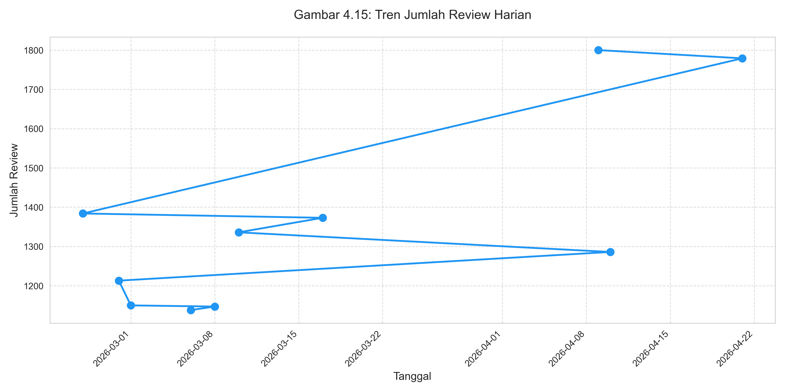

Gambar 4.6 Grafik Tren Jumlah Review Harian

Gambar 4.6 memvisualisasikan kesepuluh hari dengan volume ulasan tertinggi pada Tabel 4.13 yang dihubungkan secara kronologis berdasarkan tanggal kemunculannya. Titik tertinggi pada grafik berada pada tanggal 9 April 2026 dengan 1.800 ulasan, yang kemudian diikuti oleh titik pada tanggal 21 April 2026 dengan 1.779 ulasan.

Pola garis yang tidak beraturan (zig-zag) pada grafik tersebut terjadi karena titik-titik yang ditampilkan hanya mewakili hari-hari puncak yang tidak berurutan setiap harinya, bukan rangkaian data harian yang berkesinambungan. Meskipun demikian, grafik ini tetap memperlihatkan bahwa hari-hari dengan volume ulasan tertinggi terkonsentrasi pada rentang akhir Februari, pertengahan Maret, dan terutama awal hingga pertengahan April 2026, yang mengindikasikan adanya lonjakan aktivitas pengguna pada periode-periode tersebut.

4.7.2 Tren Sentimen Per Bulan

Distribusi sentimen per bulan selama periode Februari hingga April 2026 ditunjukkan pada Tabel 4.14.

Tabel 4.14 Distribusi Sentimen Per Bulan

| Bulan | Jml. Negatif | % Negatif | Jml. Netral | % Netral | Jml. Positif | % Positif |
| --- | --- | --- | --- | --- | --- | --- |
| Februari 2026 | 1.711 | 36,28% | 491 | 10,41% | 2.514 | 53,31% |
| Maret 2026 | 9.912 | 35,55% | 2.360 | 8,46% | 15.611 | 55,99% |
| April 2026 | 5.946 | 35,21% | 1.187 | 7,03% | 9.753 | 57,76% |

Tabel 4.14 menunjukkan distribusi sentimen per bulan selama periode penelitian berdasarkan hasil prediksi model IndoBERT. Proporsi sentimen positif tetap dominan pada seluruh periode dan meningkat secara bertahap dari 53,31% pada bulan Februari menjadi 57,76% pada bulan April. Proporsi sentimen negatif relatif tinggi dan cenderung stabil pada kisaran 35–36% sepanjang periode penelitian (36,28% pada bulan Februari, 35,55% pada bulan Maret, dan 35,21% pada bulan April), sedangkan sentimen netral menjadi kelas minoritas dengan proporsi yang menurun dari 10,41% pada bulan Februari menjadi 7,03% pada bulan April.

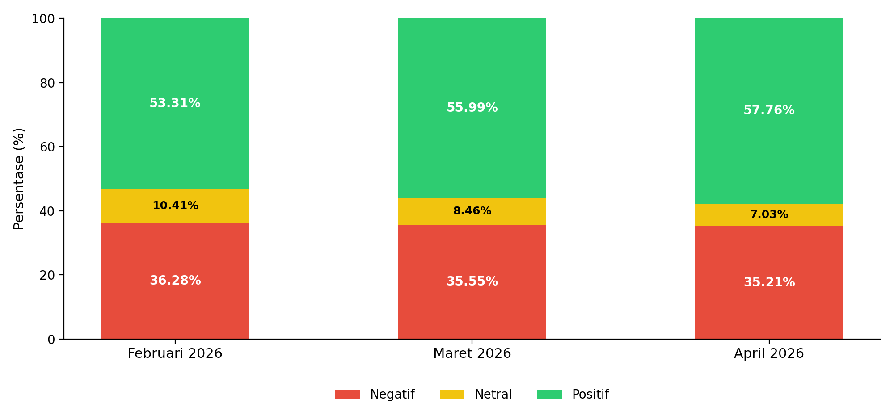

Gambar 4.7 Grafik Tren Sentimen Per Bulan

Gambar 4.7 memvisualisasikan tren sentimen per bulan dalam bentuk stacked bar chart, dengan warna merah merepresentasikan sentimen negatif, kuning merepresentasikan sentimen netral, dan hijau merepresentasikan sentimen positif.

Pada bulan Februari 2026, proporsi sentimen positif tercatat sebesar 53,31%, sentimen negatif sebesar 36,28%, dan sentimen netral sebesar 10,41%. Proporsi sentimen positif kemudian meningkat menjadi 55,99% pada bulan Maret 2026 dan 57,76% pada bulan April 2026, sementara proporsi sentimen negatif relatif stabil, sedikit menurun menjadi 35,55% pada bulan Maret 2026 dan 35,21% pada bulan April 2026. Proporsi sentimen netral juga menurun secara bertahap dari 10,41% pada bulan Februari menjadi 8,46% pada bulan Maret dan 7,03% pada bulan April.

Ketiga batang pada grafik tersebut secara konsisten menunjukkan bahwa segmen hijau (positif) selalu menempati proporsi terbesar dibandingkan segmen merah (negatif) dan segmen kuning (netral), yang mengindikasikan bahwa dominasi sentimen positif terhadap aplikasi Roblox relatif stabil sepanjang periode penelitian. Meskipun demikian, proporsi sentimen negatif berdasarkan hasil klasifikasi IndoBERT (35,21–36,28%) jauh lebih tinggi dibandingkan dengan proporsi sentimen negatif berdasarkan pendekatan berbasis rating pada periode yang sama (26,59–31,59%). Perbedaan ini mengindikasikan bahwa sebagian pengguna menuliskan keluhan atau kritik pada teks ulasannya meskipun memberikan skor rating yang relatif tinggi, sebuah pola yang tidak dapat ditangkap apabila sentimen hanya diukur berdasarkan skor bintang semata.

4.7.3 Analisis Faktor Dominan pada Hari Puncak

Pada hari-hari dengan volume ulasan tinggi (hari puncak), topik yang paling sering dibahas oleh pengguna berkaitan dengan lima hal, yaitu: (1) bug dan masalah teknis; (2) fitur chat; (3) pengalaman bermain; (4) variasi permainan dan map; serta (5) pembaruan (update) aplikasi. Ulasan positif secara umum banyak membahas pengalaman bermain yang menyenangkan serta beragamnya pilihan permainan yang tersedia, sedangkan ulasan negatif banyak membahas isu teknis, seperti lag, bug, dan perubahan fitur tertentu yang dianggap mengganggu pengalaman bermain.

Analisis tren temporal ini menunjukkan bahwa fluktuasi volume dan sentimen ulasan sering berkaitan dengan perubahan pada aplikasi Roblox, khususnya pembaruan yang dirilis oleh pengembang. Temuan ini dapat menjadi acuan bagi pengembang untuk memahami respons pengguna terhadap setiap perubahan yang dilakukan pada aplikasi.

4.8 Implementasi Dashboard Streamlit

Sebagai luaran akhir penelitian, dibangun sebuah dashboard interaktif berbasis Streamlit yang memungkinkan pengguna melakukan analisis sentimen dan visualisasi tren ulasan secara real-time.

Dashboard ini mengintegrasikan model IndoBERT yang telah dilatih ke dalam antarmuka web yang dapat diakses secara lokal melalui perintah streamlit run app.py.

Dashboard terdiri atas lima halaman utama yang saling melengkapi, yaitu halaman Overview, Analisis Sentimen, Tren Temporal, Model dan Evaluasi, serta Scraping dan Preprocessing.

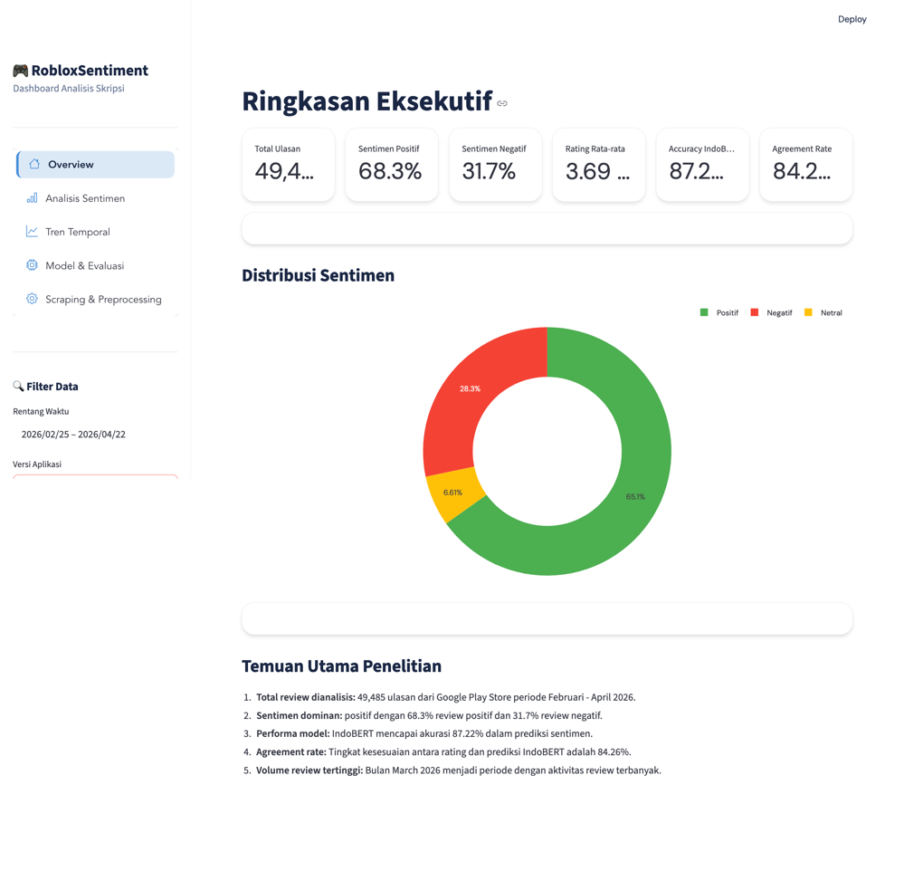

Gambar 4.8 Tampilan Halaman Overview Dashboard

Gambar 4.8 menampilkan halaman Overview dashboard yang menyajikan ringkasan eksekutif dari hasil analisis sentimen secara keseluruhan, meliputi metrik ringkasan seperti total ulasan yang dianalisis, proporsi distribusi sentimen positif, netral, dan negatif, serta rata-rata rating aplikasi. Halaman ini dirancang agar pengguna dashboard dapat memperoleh gambaran umum kondisi sentimen aplikasi Roblox secara cepat sebelum menelusuri detail pada halaman-halaman berikutnya.

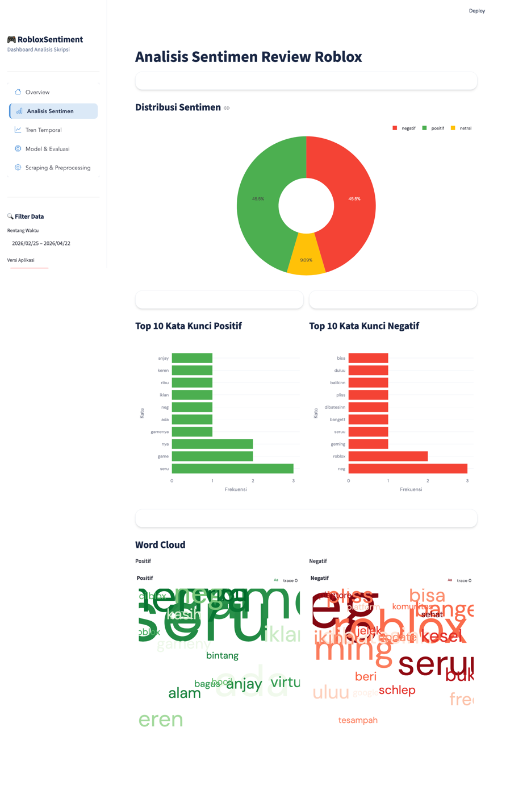

Gambar 4.9 Tampilan Halaman Analisis Sentimen Dashboard

Gambar 4.9 menampilkan halaman Analisis Sentimen yang menyajikan distribusi sentimen beserta analisis detail per kategori. Halaman ini memungkinkan pengguna untuk menelusuri contoh ulasan pada masing-masing kelas sentimen dan membandingkan proporsi antarkelas secara lebih mendalam dibandingkan dengan ringkasan yang ditampilkan pada halaman Overview.

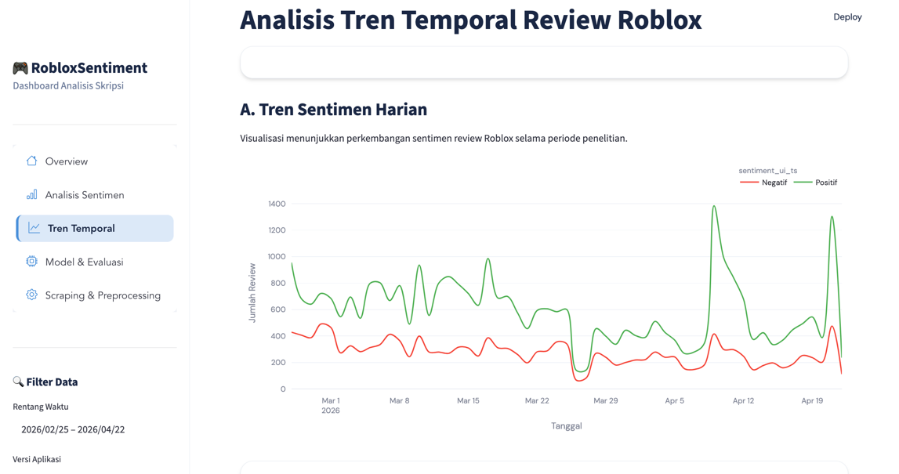

Gambar 4.10 Tampilan Halaman Tren Temporal Dashboard

Gambar 4.10 menampilkan halaman Tren Temporal yang memvisualisasikan perubahan sentimen pengguna dari waktu ke waktu. Halaman ini menyajikan grafik tren volume dan proporsi sentimen secara interaktif, sehingga pengembang dapat mengidentifikasi periode-periode tertentu yang mengalami lonjakan ulasan negatif maupun positif secara lebih mudah dibandingkan dengan analisis statis pada laporan tertulis.

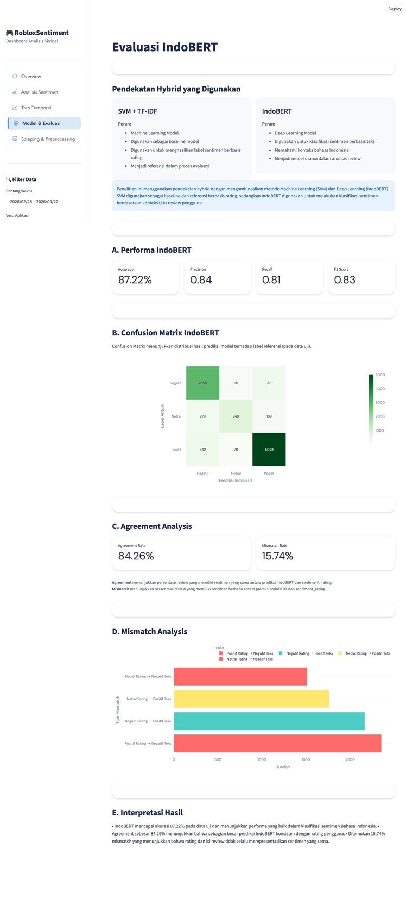

Gambar 4.11 Tampilan Halaman Model & Evaluasi Dashboard

Gambar 4.11 menampilkan halaman Model dan Evaluasi yang menyajikan perbandingan performa kedua model yang telah dibangun. Halaman ini menampilkan metrik evaluasi seperti akurasi, precision, recall, dan F1-score dari model SVM Baseline dan IndoBERT secara berdampingan, sehingga memudahkan pengguna untuk memahami keunggulan model IndoBERT tanpa perlu membaca tabel classification report secara terpisah.

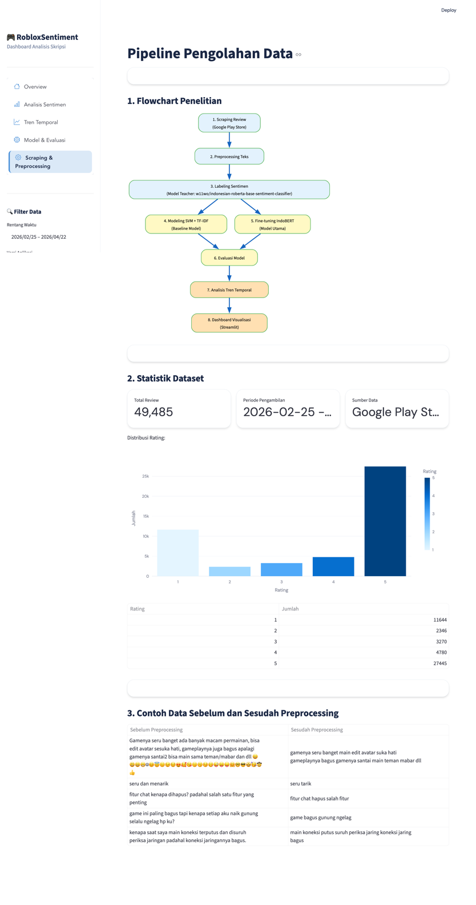

Gambar 4.12 Tampilan Halaman Scraping & Preprocessing Dashboard

Gambar 4.12 menampilkan halaman Scraping dan Preprocessing yang menampilkan alur pengumpulan dan pembersihan data secara ringkas. Halaman ini menyajikan statistik jumlah data pada setiap tahapan praproses, termasuk jumlah data yang tereliminasi, sehingga transparansi proses pengolahan data dari tahap awal hingga akhir dapat dipantau langsung melalui dashboard.

Seluruh komponen visualisasi pada dashboard dibangun menggunakan pustaka Plotly dan Matplotlib yang terintegrasi dalam ekosistem Streamlit, sehingga menghasilkan tampilan yang interaktif dan responsif bagi pengguna.